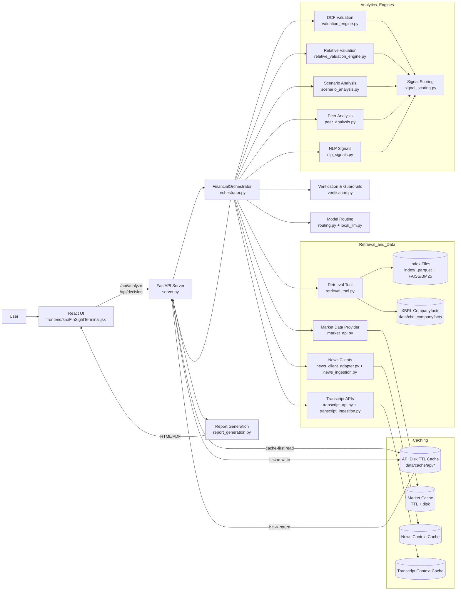

# FinSignal AI System Architecture

## Runtime Flow (High Level)
1. User submits query from React UI.
2. FastAPI checks in-memory + disk cache first.
3. Cache miss calls orchestrator for retrieval, verification, analytics, and routing.
4. Results are post-processed into structured answer + evidence + optional report (HTML/PDF).
5. Response is cached and returned to UI.

